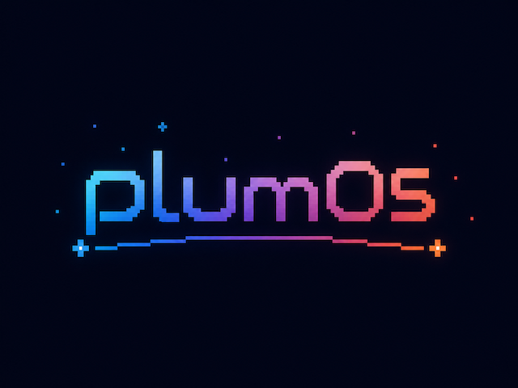
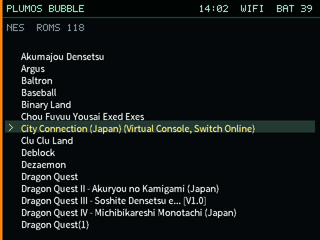
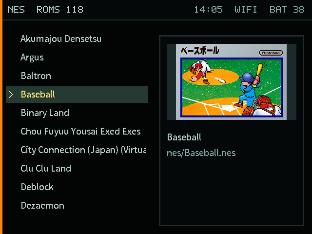
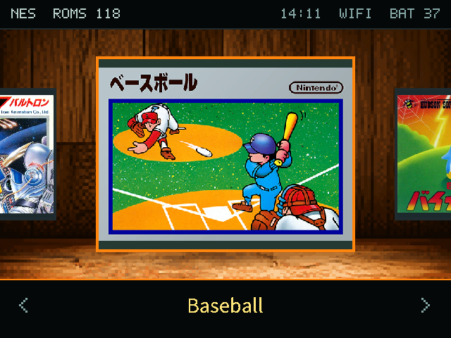

<p align="center">
  
</p>

# plumOS Bubble

plumOS Bubble is a Linux-based custom firmware for the GKD Bubble
(RK3566 / ARM64). It brings the game frontend, RetroArch, PicoArch, standalone
emulators, the dedicated Game Gear frontend, PortMaster, Pyxel, and network
transfer tools into one consistent interface.

## Screenshots

| Text mode | Graphics mode |
| :---: | :---: |
|  |  |

| Gallery mode | Game Gear Frontend (GGFE) |
| :---: | :---: |
|  |  |

## Documentation

User documentation and developer documentation are kept separate, with both
English and Japanese entry points.

- [Documentation index](docs/README.md)
- [User manual](docs/user/README.md)
- [Supported systems, ROM directories, extensions, and emulators](docs/user/supported-systems.md)
- [Emulators and hotkeys](docs/user/emulators.md)
- [Developer guide](docs/developer/README.md)
- [日本語の概要](README.ja.md)

## Developer quick start

With the approved vendor inputs available, build the full release-candidate SD
image with:

```sh
PLUMOS_BUBBLE_VERSION=<version> \
PLUMOS_BUBBLE_INCLUDE_CAPTURED_VENDOR_GPU=1 \
./scripts/build-bubble-frontend-probe-image.sh
```

Generated artifacts are written below `output/` and are not tracked by Git.
ROMs, user-supplied BIOS files, saves, network credentials, and private keys
must not be included in the repository or public artifacts.

## License

plumOS-authored material is licensed under the [MIT License](LICENSE).
Distributed material derived from stockOS remains the property of GKD, and
vendor and third-party components retain their own terms. DraStic follows the
same project-approved inclusion policy as plumOS MF.

- [Third-party notices](THIRD_PARTY_NOTICES.md)
- [GKD stockOS permission notice](docs/licenses/GKD-stockOS-PERMISSION-NOTICE.txt)
- [Bubble vendor runtime notice](docs/licenses/bubble-vendor-runtime-NOTICE.txt)
